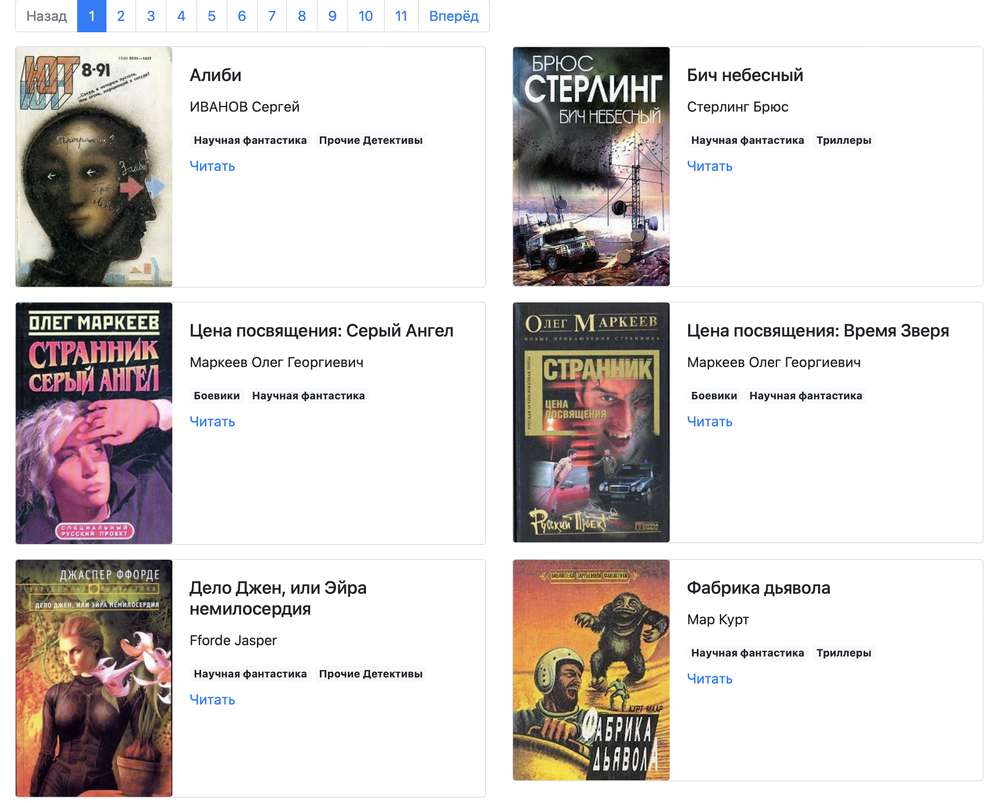

# Парсер книг с сайта tululu.org

Данный проект помогает автоматизировать процесс скачивания книг с обложками и отзывами с сайта [tululu.org](tululu.org), а также создаёт на их основе локальный сайт.

Пример готового сайта можно увидеть [здесь](https://jmuriki.github.io/library_parser/).




## Установка

Должен быть установлен python3.

Затем используйте pip (или pip3, если есть конфликт с python2) для установки зависимостей:

```
pip install -r requirements.txt
```

или

```
pip3 install -r requirements.txt
```

Рекомендуется использовать virtualenv / venv для изоляции проекта.


## Запуск

### `library_parser.py`

Находясь в директории проекта, откройте с помощью python3 файл `library_parser.py`

```
python library_parser.py
```

Аргументы, обозначающие id первой и последней книги диапазона для скачивания, являются необязательными. По умолчанию будут скачаны книги с 1й по 10ю включительно.

```
python library_parser.py --start_id 1 --end_id 10
```

В случае успешного запуска, в директории проекта будут созданы 2 папки:

- папка `books`, в которую будут скачаны тексты книг и Гид по отзывам;

- папка `images`, в которую будут скачаны обложки.


### `parse_tululu_category.py`

Находясь в директории проекта, откройте с помощью python3 файл `parse_tululu_category.py`

```
python parse_tululu_category.py
```
По умолчанию, в директории проекта будет создан файл `books_descriptions.json` с данными о книгах, а также папки `books` и `images`, в которые будут скачаны тексты книг и обложки из категории `Научная фантастика`.

Доступен ряд аргументов, и все они являются необязательными.

Для того, чтобы увидеть меню со справкой об аргументах, запустите скрипт с аргументом `-h` или `--help`:

```
python parse_tululu_category.py -h
```

```
python parse_tululu_category.py --help
```

В результате в консоль выведется следующее:

```
usage: parse_tululu_category.py [-h] [-g GENRE] [-s START_PAGE] [-e END_PAGE] [-f DEST_FOLDER] [-i] [-t] [-j JSON_PATH]

Все представленные аргументы являются опциональными. По умолчанию будут скачаны все книги и картинки со всех доступных страниц в заранее
определённые папки в корневом каталоге проекта.

options:
  -h, --help            show this help message and exit
  -g GENRE, --genre GENRE
                        Введите номер жанра. По умолчанию будет указан номер 55, что соответствует жанру "Научная фантастика".
  -s START_PAGE, --start_page START_PAGE
                        Введите номер начальной страницы. Если не вводить номер конечной страницы, будут скачаны все доступные страницы с
                        начальной включительно.
  -e END_PAGE, --end_page END_PAGE
                        Введите номер конечной страницы. Если не вводить номер начальной страницы, будут скачаны все доступные страницы с
                        первой по конечную включительно.
  -f DEST_FOLDER, --dest_folder DEST_FOLDER
                        Введите путь к каталогу с результатами парсинга: картинкам, книгам, JSON.
  -i, --skip_imgs       По умолчанию картинки будут скачаны. Для отмены укажите при запуске аргумент без значения.
  -t, --skip_txt        По умолчанию тексты книг будут скачаны. Для отмены укажите при запуске аргумент без значения.
  -j JSON_PATH, --json_path JSON_PATH
                        Введите путь к *.json файлу с результатами.
```

### `render_website.py`

Данный скрипт собирает из скачанных книг, обложек и прочих метаданных локальный сайт, а также создаёт и запускает локальный сервер.

Страницы сайта формируются на основе шаблона `template.html` и обновляются без перезагрузки при любом изменении шаблона.

Стартовая страница будет доступна по адресу:

```
127.0.0.1:5500
```


## Цель проекта

Код написан в образовательных целях на онлайн-курсе для веб-разработчиков https://dvmn.org/.